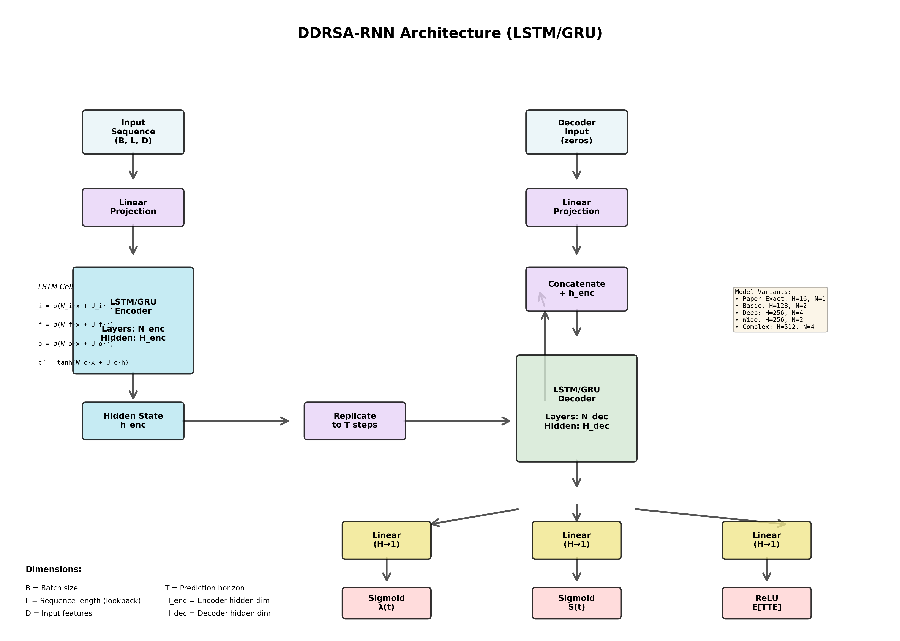

# Architectural Diagram Visualization Guide

## Overview

This guide explains how to generate and customize publication-quality architectural diagrams for all DDRSA model variants using the `draw_architectures.py` script.

## Quick Start

### Generate All Diagrams

```bash
python draw_architectures.py
```

This creates **4 publication-ready diagrams** at 300 DPI in the `figures/` directory:

1. **architecture_rnn.png** - DDRSA-RNN (LSTM/GRU) architecture
2. **architecture_transformer.png** - DDRSA-Transformer architecture
3. **architecture_probsparse.png** - DDRSA-ProbSparse (Informer) architecture
4. **architecture_loss.png** - Loss function architecture

## Generated Diagrams

### 1. DDRSA-RNN Architecture (`architecture_rnn.png`)

**Shows:**
- Complete encoder-decoder RNN architecture
- LSTM cell equations (input, forget, output gates)
- Data flow from input → encoder → decoder → outputs
- Three output heads: λ(t), S(t), E[TTE]
- Hidden state replication mechanism
- All 5 model variants with configurations

**Key Features:**
- ✅ Layer-by-layer breakdown with dimensions
- ✅ LSTM gate equations (i, f, o, c)
- ✅ Color-coded components (input, encoder, decoder, output)
- ✅ Configuration box showing all variants:
  - Paper Exact: H=16, N=1
  - Basic: H=128, N=2
  - Deep: H=256, N=4
  - Wide: H=256, N=2
  - Complex: H=512, N=4

**Best For:**
- Understanding basic DDRSA architecture
- Explaining encoder-decoder structure
- Showing LSTM internal mechanics

---

### 2. DDRSA-Transformer Architecture (`architecture_transformer.png`)

**Shows:**
- Full encoder-decoder transformer with attention mechanisms
- Multi-head self-attention detail with QKV decomposition
- Positional encoding
- Cross-attention between encoder and decoder
- Feed-forward networks
- Add & Norm operations
- Attention formula: `Attention(Q,K,V) = softmax(QK^T/√d_k)V`

**Key Features:**
- ✅ Encoder side: Self-attention → FFN (N_enc layers)
- ✅ Decoder side: Masked self-attention → Cross-attention → FFN (N_dec layers)
- ✅ Detailed attention mechanism diagram showing:
  - Query, Key, Value computation
  - Multi-head splitting
  - Concatenation and linear projection
- ✅ All 5 transformer variants:
  - Basic: d=64, h=4, N_enc=2, N_dec=2
  - Deep: d=128, h=8, N_enc=6, N_dec=4
  - Wide: d=256, h=8, N_enc=4, N_dec=4
  - GELU: d=128, h=8, N_enc=4, N_dec=4
  - Complex: d=256, h=16, N_enc=8, N_dec=6

**Best For:**
- Understanding transformer attention mechanisms
- Explaining encoder-decoder interaction
- Showing multi-head attention details
- Publication figures for transformer-based models

---

### 3. DDRSA-ProbSparse Architecture (`architecture_probsparse.png`)

**Shows:**
- ProbSparse attention mechanism with O(L log L) complexity
- Distilling operations for sequence reduction
- Hybrid architecture: ProbSparse encoder + LSTM decoder
- Sparsity measurement formula
- Complexity comparison with standard attention

**Key Features:**
- ✅ ProbSparse attention layers with sequence reduction (L → L/2 → L/4)
- ✅ Distilling operation (Conv1D + MaxPool) between layers
- ✅ Sparsity measurement formula:
  ```
  M(q_i, K) = max(q_i·K^T) - (1/L)∑(q_i·K^T)
  Select top-u queries where u = c·ln(L)
  ```
- ✅ Complexity comparison box:
  - Standard Attention: O(L²) = 262,144 operations for L=512
  - ProbSparse Attention: O(L log L) ≈ 4,608 operations for L=512
  - **Speedup: ~57×**
- ✅ Key innovations highlighted
- ✅ Configuration variants (Basic, Deep)

**Best For:**
- Explaining efficient attention mechanisms
- Showing how to handle long sequences
- Demonstrating computational complexity reduction
- Publishing Informer/ProbSparse papers

---

### 4. Loss Function Diagram (`architecture_loss.png`)

**Shows:**
- Complete DDRSA loss function architecture
- Two main components: L_survival and L_hazard
- Lambda (λ) balancing parameter
- Optional NASA scoring function
- Mathematical formulas for each component

**Key Features:**
- ✅ **Survival Loss**:
  ```
  L_survival = -∑[δ_i · log(1 - S(t_i)) + (1-δ_i) · log(S(t_i))]
  ```
  - Uses event indicator δ_i
  - Handles censored data

- ✅ **Hazard Loss**:
  ```
  L_hazard = MSE(λ_pred(t), λ_true(t))
  ```
  - Ensures realistic hazard rates
  - Prevents trivial solutions

- ✅ **Combined Loss**:
  ```
  L = λ·L_survival + (1-λ)·L_hazard
  ```
  - λ selection guide (0.5, 0.75, 0.9, 1.0)

- ✅ **NASA Loss** (Optional):
  ```
  NASA_score = ∑[e^(-error/13) if early, e^(error/10) if late]
  L_total = L + w_NASA · NASA_score
  ```
  - Asymmetric penalty function
  - Penalizes late predictions more

**Best For:**
- Explaining the training objective
- Showing how survival and hazard losses combine
- Demonstrating NASA scoring integration
- Publishing methodology sections

---

## Customization

### Change Output Resolution

Edit the `dpi` parameter in any drawing function:

```python
plt.savefig(output_path, dpi=600, bbox_inches='tight')  # Higher resolution
```

### Change Colors

Modify the `COLORS` dictionary at the top of `draw_architectures.py`:

```python
COLORS = {
    'input': '#E8F4F8',      # Light blue
    'encoder': '#B8E6F0',    # Sky blue
    'attention': '#FFE8CC',  # Light orange
    'decoder': '#D4E8D4',    # Light green
    'output': '#FFD4D4',     # Light red
    'embedding': '#E8D4F8',  # Light purple
    'dense': '#F0E68C',      # Khaki
    'arrow': '#555555',      # Dark gray
    'text': '#000000'        # Black
}
```

### Change Figure Size

Modify the `figsize` parameter in each function:

```python
fig, ax = plt.subplots(figsize=(20, 14))  # Larger figure
```

### Generate Individual Diagrams

```python
from draw_architectures import *

# Generate only RNN diagram
draw_rnn_architecture(output_path='my_rnn_diagram.png')

# Generate only Transformer diagram
draw_transformer_architecture(output_path='my_transformer_diagram.png')

# Generate only ProbSparse diagram
draw_probsparse_architecture(output_path='my_probsparse_diagram.png')

# Generate only Loss diagram
draw_loss_function_diagram(output_path='my_loss_diagram.png')
```

### Add Your Own Annotations

Edit the drawing functions to add custom text:

```python
# Add custom annotation
ax.text(x, y, 'Your custom text here',
        fontsize=10, ha='center',
        bbox=dict(boxstyle='round', facecolor='yellow', alpha=0.5))
```

---

## Using Diagrams in Publications

### LaTeX

```latex
\begin{figure}[htbp]
  \centering
  \includegraphics[width=\textwidth]{figures/architecture_transformer.png}
  \caption{DDRSA-Transformer architecture showing encoder-decoder structure with multi-head attention mechanisms.}
  \label{fig:transformer_arch}
\end{figure}
```

### Markdown

```markdown

*Figure 1: DDRSA-RNN encoder-decoder architecture with LSTM cells.*
```

### PowerPoint / Keynote

Simply drag and drop the PNG files. They are high-resolution (300 DPI) and will look crisp even when scaled.

---

## Diagram Components Explained

### Color Coding

- **Light Blue** (`#E8F4F8`): Input layers
- **Sky Blue** (`#B8E6F0`): Encoder components
- **Light Orange** (`#FFE8CC`): Attention mechanisms
- **Light Green** (`#D4E8D4`): Decoder components
- **Light Red** (`#FFD4D4`): Output layers
- **Light Purple** (`#E8D4F8`): Embedding layers
- **Khaki** (`#F0E68C`): Dense/Linear layers

### Box Styles

- **Rounded boxes**: Neural network layers
- **Fancy boxes with padding**: Main architectural components
- **Circles**: Parameters (λ, w_NASA)

### Arrows

- **Solid arrows** (`→`): Data flow
- **Multi-line arrows**: Parallel data streams
- **Dashed lines**: Optional connections

---

## Technical Details

### Dependencies

```python
import matplotlib.pyplot as plt
import matplotlib.patches as mpatches
from matplotlib.patches import FancyBboxPatch, FancyArrowPatch
import numpy as np
import os
```

All standard libraries - no additional installation needed!

### Output Format

- **Format**: PNG (can be changed to PDF, SVG, etc.)
- **Resolution**: 300 DPI (publication quality)
- **Size**: Optimized for readability
- **File Size**: ~200-500 KB per diagram

### Coordinate System

- Custom coordinate system for each diagram
- `ax.set_xlim(0, 16)` and `ax.set_ylim(0, 12)` for most diagrams
- Easier to position elements with simple coordinates

---

## Comparison with Paper Diagrams

### Traditional Paper Diagrams

✅ **This Script Provides:**
- Professional box-and-arrow diagrams
- Publication-ready quality (300 DPI)
- Consistent color scheme
- Mathematical formulas included
- Dimension annotations
- Layer-by-layer breakdown

❌ **Does NOT Provide:**
- Hand-drawn artistic illustrations
- 3D visualizations
- Interactive diagrams
- Animations

### Alternative Tools

For different diagram styles:

1. **TikZ (LaTeX)**: More precise, vector graphics, steeper learning curve
2. **Draw.io**: Manual drawing, good for custom shapes
3. **Graphviz**: Great for graph structures, less control over layout
4. **PlotNeuralNet**: 3D layered visualizations
5. **NN-SVG**: Interactive neural network diagrams

**Our Script's Advantage:**
- ✅ Fully automated - regenerate anytime
- ✅ Consistent style across all architectures
- ✅ Easy to customize with Python
- ✅ Includes all mathematical formulas
- ✅ Shows actual DDRSA configurations

---

## Examples Gallery

### RNN Architecture Highlights

```
Input → Linear → LSTM Encoder → Hidden State
                                      ↓
                              Replicate to T steps
                                      ↓
Decoder Input → Linear → Concatenate → LSTM Decoder
                                           ↓
                                    ┌──────┼──────┐
                                    ↓      ↓      ↓
                                  λ(t)   S(t)  E[TTE]
                                Sigmoid Sigmoid  ReLU
```

### Transformer Attention Detail

```
Input → Linear Embedding → Positional Encoding
                                ↓
                    ┌──────────────────────┐
                    ↓           ↓          ↓
                    Q           K          V
                    └─────→ QK^T/√d ─────→ softmax → ×V
                                ↓
                          Multi-head (h heads)
                                ↓
                          Concatenate → Linear
```

### ProbSparse Complexity Reduction

```
Sequence Length Reduction:
L=512 → L/2=256 → L/4=128 → L/8=64
  ↓        ↓         ↓         ↓
ProbSparse ProbSparse ProbSparse Final
Attention  Attention  Attention  Output
  ↓        ↓         ↓
Distill  Distill   Distill
(Conv1D) (Conv1D)  (Conv1D)

Complexity: O(L²) → O(L log L)
Speedup for L=512: ~57×
```

---

## Troubleshooting

### Issue: "No module named 'matplotlib'"

**Solution:**
```bash
pip install matplotlib
```

### Issue: Diagrams look blurry

**Solution:** Increase DPI:
```python
plt.savefig(output_path, dpi=600, bbox_inches='tight')  # Higher quality
```

### Issue: Text too small

**Solution:** Increase font sizes in the script:
```python
def draw_box(ax, x, y, width, height, text, color, fontsize=12):  # Increase from 9
```

### Issue: Want different colors

**Solution:** Modify the `COLORS` dictionary with hex color codes.

### Issue: Need vector graphics (PDF/SVG)

**Solution:** Change file extension:
```python
draw_rnn_architecture(output_path='figures/architecture_rnn.pdf')
draw_rnn_architecture(output_path='figures/architecture_rnn.svg')
```

---

## Best Practices for Publications

### 1. **Use High DPI**
```python
plt.savefig(output_path, dpi=300, bbox_inches='tight')  # Minimum for print
```

### 2. **Choose Appropriate Colors**
- Use colorblind-friendly palettes
- Ensure sufficient contrast
- Keep it simple (5-7 colors max)

### 3. **Add Detailed Captions**
Always include comprehensive figure captions in your paper explaining:
- What each color represents
- Data flow direction
- Key components
- Dimension annotations

### 4. **Consistent Styling**
Use the same color scheme and box styles across all diagrams in your paper.

### 5. **Mathematical Precision**
Ensure all formulas match your implementation exactly.

---

## Summary

✅ **What You Get:**
- 4 publication-quality architectural diagrams
- 300 DPI resolution (suitable for papers)
- Professional color scheme
- Mathematical formulas included
- All DDRSA variants documented
- Fully customizable Python script

✅ **Use Cases:**
- Research papers (PDF export)
- Presentations (PNG/SVG)
- Documentation (PNG)
- Thesis/Dissertation (High-DPI PDF)
- Blog posts (PNG)
- Teaching materials (any format)

✅ **Easy to Use:**
```bash
python draw_architectures.py  # Done! All diagrams generated.
```

---

**Questions?** Check the code comments in `draw_architectures.py` for detailed function documentation.

**Want More?** Extend the script with:
- Additional model variants
- Training pipeline diagrams
- Data preprocessing flow
- Evaluation metric visualizations
