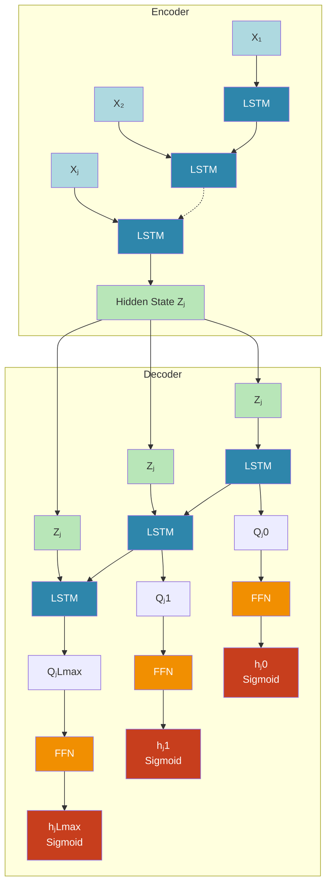
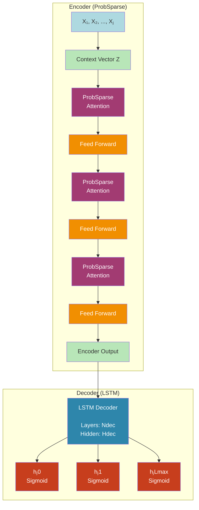
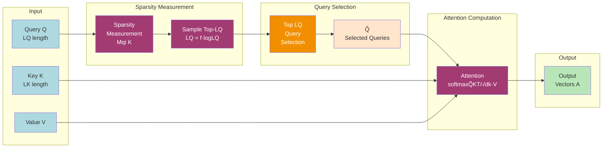
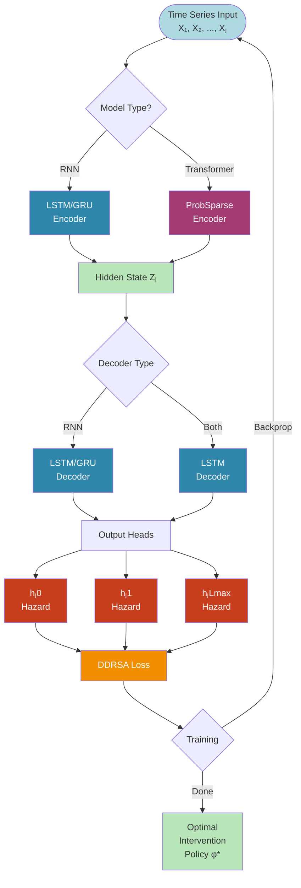
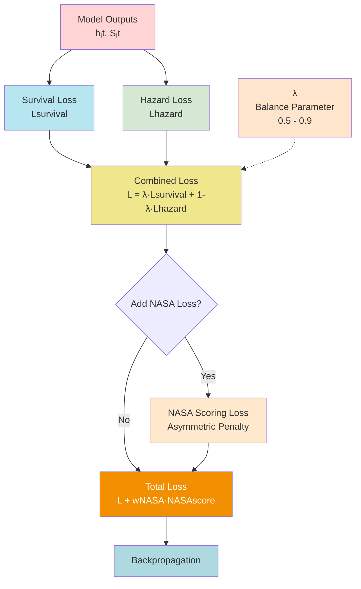
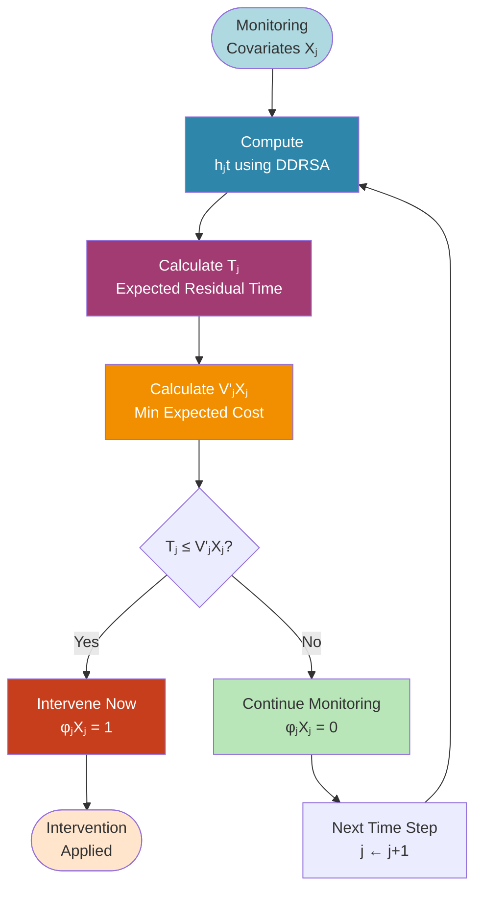
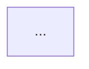

# Mermaid Diagrams for DDRSA Architectures

This file contains Mermaid diagram code for all DDRSA architectures. You can render these in:
- GitHub (native support)
- Mermaid Live Editor: https://mermaid.live/
- Documentation sites (GitBook, MkDocs, etc.)
- VS Code with Mermaid extension

---

## 1. Original DDRSA Architecture



---

## 2. Modified DDRSA with ProbSparse Attention



---

## 3. ProbSparse Attention Mechanism



---

## 4. Complete DDRSA Flow (Simplified)



---

## 5. Loss Function Architecture



---

## 6. Training Pipeline

```mermaid
flowchart LR
    subgraph Data
        Raw[Raw Time Series<br/>Turbofan/Azure PM] --> Preprocess[Preprocessing<br/>Scaling, Windowing]
        Preprocess --> Split[Train/Val/Test<br/>Split]
    end

    subgraph Model
        Split --> Init[Initialize<br/>DDRSA Model]
        Init --> Forward[Forward Pass<br/>Compute Hazards]
        Forward --> Loss[Compute Loss<br/>DDRSA + NASA]
        Loss --> Backward[Backward Pass<br/>Update Weights]
        Backward --> Check{Early<br/>Stopping?}
        Check -->|No| Forward
        Check -->|Yes| Best[Best Model<br/>Checkpoint]
    end

    subgraph Evaluation
        Best --> Test[Test Set<br/>Evaluation]
        Test --> Metrics[Metrics<br/>MAE, C-Index<br/>NASA Score]
        Metrics --> Policy[Compute<br/>Optimal Policy φ*]
    end

    style Raw fill:#AED9E0
    style Init fill:#2E86AB,color:#fff
    style Forward fill:#A23B72,color:#fff
    style Loss fill:#F18F01,color:#fff
    style Best fill:#B8E6B8
    style Metrics fill:#FFE5CC
    style Policy fill:#C73E1D,color:#fff
```



---

## 7. Optimal Intervention Policy



---

## 8. Transformer Encoder-Decoder (Detailed)

```mermaid
graph TB
    subgraph Encoder
        E_Input[Input Sequence] --> E_Embed[Linear<br/>Embedding]
        E_Embed --> E_Pos[Positional<br/>Encoding]
        E_Pos --> E_Attn1[Multi-Head<br/>Self-Attention]
        E_Attn1 --> E_Norm1[Add & Norm]
        E_Norm1 --> E_FF1[Feed-Forward<br/>Network]
        E_FF1 --> E_Norm2[Add & Norm]
        E_Norm2 -.-> E_AttnN[N encoder layers]
        E_AttnN --> E_Out[Encoder<br/>Output]
    end

    subgraph Decoder
        D_Input[Decoder Input] --> D_Embed[Linear<br/>Embedding]
        D_Embed --> D_Pos[Positional<br/>Encoding]
        D_Pos --> D_Attn1[Masked<br/>Self-Attention]
        D_Attn1 --> D_Norm1[Add & Norm]
        D_Norm1 --> D_Cross[Cross-Attention<br/>Q from Dec, K V from Enc]
        E_Out --> D_Cross
        D_Cross --> D_Norm2[Add & Norm]
        D_Norm2 --> D_FF[Feed-Forward<br/>Network]
        D_FF --> D_Norm3[Add & Norm]
        D_Norm3 -.-> D_AttnN[N decoder layers]
        D_AttnN --> D_Out[Decoder<br/>Output]
    end

    D_Out --> Out1[λt<br/>Hazard]
    D_Out --> Out2[St<br/>Survival]
    D_Out --> Out3[E[TTE]<br/>Expected]

    style E_Input fill:#AED9E0
    style E_Embed fill:#E8D4F8
    style E_Pos fill:#E8D4F8
    style E_Attn1 fill:#FFE8CC
    style E_FF1 fill:#F18F01,color:#fff
    style E_Out fill:#B8E6B8
    style D_Input fill:#AED9E0
    style D_Embed fill:#E8D4F8
    style D_Pos fill:#E8D4F8
    style D_Attn1 fill:#FFE8CC
    style D_Cross fill:#A23B72,color:#fff
    style D_FF fill:#F18F01,color:#fff
    style D_Out fill:#B8E6B8
    style Out1 fill:#C73E1D,color:#fff
    style Out2 fill:#C73E1D,color:#fff
    style Out3 fill:#C73E1D,color:#fff
```

---

## Usage Instructions

### In GitHub README

Simply paste the code blocks into your `README.md`:

```markdown
## Architecture Diagram


```

### In Mermaid Live Editor

1. Go to https://mermaid.live/
2. Paste any diagram code
3. Export as PNG/SVG/PDF

### In VS Code

1. Install "Markdown Preview Mermaid Support" extension
2. Open this file
3. Click "Preview" to see diagrams

### In Documentation Sites

Most modern documentation frameworks (MkDocs, GitBook, Docusaurus) support Mermaid natively.

---

## Customization

### Change Colors

Modify the `style` lines at the end of each diagram:

```mermaid
style NodeName fill:#ColorCode,color:#TextColor
```

### Add More Nodes

Add new nodes following the pattern:

```mermaid
NodeID[Display Text] --> NextNode[Next Step]
```

### Change Layout Direction

- `graph TB` - Top to Bottom
- `graph LR` - Left to Right
- `graph BT` - Bottom to Top
- `graph RL` - Right to Left

---

## Tips for Best Results

1. **Keep it Simple**: Mermaid works best with clear, simple diagrams
2. **Use Subgraphs**: Group related components together
3. **Color Code**: Use consistent colors for component types
4. **Add Legends**: Include style definitions for clarity
5. **Test Rendering**: Preview in Mermaid Live before committing

---

## Exporting

### To PNG/SVG (Mermaid Live)
1. Open diagram in https://mermaid.live/
2. Click "Actions" → "PNG/SVG"
3. Download

### To PDF (Mermaid CLI)
```bash
npm install -g @mermaid-js/mermaid-cli
mmdc -i MERMAID_DIAGRAMS.md -o output.pdf
```

### To HTML
```bash
pandoc MERMAID_DIAGRAMS.md -o diagrams.html --filter mermaid-filter
```

---

## Comparison: Mermaid vs Python

| Feature | Mermaid | Python (Matplotlib) |
|---------|---------|---------------------|
| **Ease of use** | ✅ Very easy | ⚠️ Moderate |
| **Customization** | ⚠️ Limited | ✅ Unlimited |
| **Resolution** | ⚠️ Depends on export | ✅ 300+ DPI |
| **Interactivity** | ✅ Can be interactive | ❌ Static |
| **Version control** | ✅ Text-based | ❌ Binary images |
| **Auto-update** | ✅ Edit text, auto-renders | ❌ Re-run script |

**Recommendation**:
- Use **Mermaid** for documentation, GitHub, quick drafts
- Use **Python** for publications, posters, high-quality figures

---

## All Diagrams Combined

For a complete overview, you can render all diagrams in sequence or combine them into a single comprehensive diagram showing the entire DDRSA system from data input to optimal policy output.
